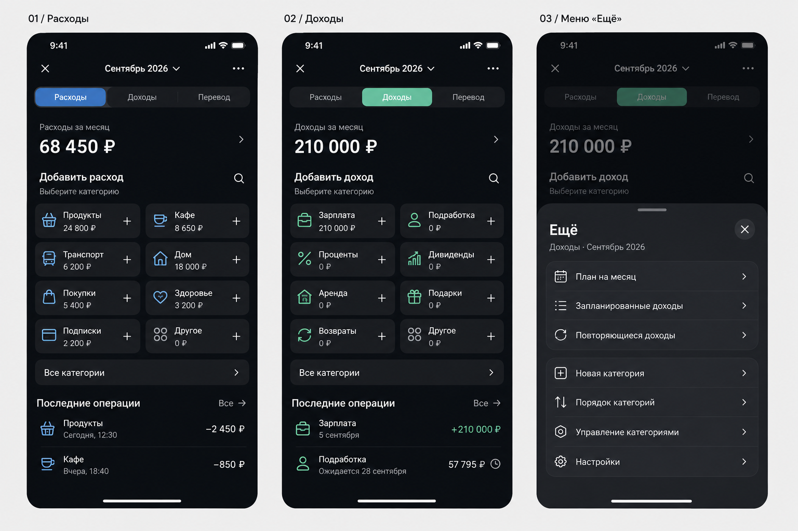

# Упрощение расходов и доходов

Дата: 2026-09-06. Статус: визуальное предложение для обсуждения, не утверждённая реализация. Код приложения не менялся.

## Задача

Сохранить функции, сделать экран простым и наглядным, перенести редко используемые действия в меню. Основание: скриншот и прямой запрос пользователя. Сохранены тёмная тема, переключение расходов/доходов/перевода и карточный выбор категорий. Названия категорий и суммы в макете иллюстративные; реальные пользовательские категории не переименовывать.

## Основной экран

Одна строка навигации: закрыть, месяц, «Ещё». Затем переключатель типа, компактная сумма месяца, восемь карточек в двух колонках, все категории, две последние операции. Карточка целиком добавляет операцию; маленький плюс является подсказкой того же действия, а не отдельной вложенной кнопкой. Подпись «Выберите категорию» поясняет сценарий. Суммы в карточках — итог категории за выбранный месяц.

Убраны двойные контейнеры, свечение, крупное кольцо, дублирующий вход в историю и ряд служебных кнопок. Настройка плана скрыта в меню; если установлен план и есть превышение/недобор, короткий содержательный статус остаётся под суммой. Предупреждение не должно исчезнуть вместе с кнопкой настройки. На рисунке показан месяц без настроенного бюджета.

## Сохранение функций

| Функция | Новое место |
|---|---|
| Закрыть экран | Крестик сверху |
| Расходы / доходы / перевод | Постоянный переключатель |
| Предыдущий/следующий месяц, выбор месяца | Нажатие на месяц открывает выбор со стрелками и возвратом к текущему месяцу; сохранить допустимый диапазон исходного экрана |
| Итог месяца и разбивка по категориям | Сумма со стрелкой открывает существующую историю с детализацией; кольцо доступно там |
| Добавление по категории | Нажатие карточки открывает существующий редактор с выбранными типом и категорией |
| Поиск категории | Лупа рядом с заголовком добавления, раскрывающая строку поиска |
| Все категории | Отдельная строка под сеткой, включая нулевые и длинные названия |
| История и её фильтры | «Последние операции → Все»; в полной истории сохранить поиск, категории и статусы «Все / Предстоящие / Проведённые» |
| Редактирование операции и проведение плана | Нажатие строки истории; сохранить существующие команды и подтверждения |
| Бюджет / цель доходов | «Ещё → План на месяц»; не смешивать бюджет с отдельными запланированными операциями |
| Одноразовые планы | «Ещё → Запланированные расходы/доходы» |
| Повторяющиеся доходы | «Ещё → Повторяющиеся доходы» |
| Массовый ввод расходов | «Ещё → Массовый ввод» только во вкладке расходов; сохранить текущий сценарий |
| Новая категория | «Ещё → Новая категория» |
| Сортировка и ручной порядок | «Ещё → Порядок категорий»: активность, сумма, вручную, имя; далее редактор ручного порядка |
| Закрепление, редактирование, скрытие/удаление категории, операции категории | Долгое нажатие карточки; доступный без жеста путь через «Ещё → Управление категориями»; сохранить текущие ограничения и отмену удаления |
| Настройки | «Ещё → Настройки» открывает существующие настройки |

Состав первого блока «Ещё» зависит от типа операции: на рисунке доходы. В расходах показываются план месяца, запланированные расходы и массовый ввод. Не добавлять новые финансовые возможности ради симметрии.

## Условия будущей реализации

- Закреплённые категории первыми; сортировка раздельная для доходов/расходов, сохраняется и не перестраивает сетку после сохранения операции.
- Нулевые категории остаются доступны, их текст читаемый. При менее чем восьми категориях не создавать вымышленные карточки.
- Ожидаемая операция визуально отличается от проведённой и не увеличивает фактический итог до проведения. Расчётные контракты не менять ради макета.
- На маленьком экране и с увеличенным шрифтом допускается прокрутка; не уменьшать текст ради восьми карточек. Названия до двух строк, полное имя доступно в редакторе.
- Области нажатия не менее 44 pt; названия для VoiceOver, различимость без цвета, видимые состояния поиска, пустого месяца и загрузки.
- Визуально проверены три панели: русский текст читаемый, элементы не обрезаны, расходы по восьми категориям складываются в 68 450 ₽; ожидаемый доход отделён от факта.
- Unit-тесты не запускались: это растровый дизайн и описание, исполняемый код не изменён. Проверки доступности и удобства на устройстве потребуются при реализации.

## Источники и генерация

Проверены `CashflowUnifiedEntryView.swift`, `CashflowUnifiedEntryContainer.swift`, `CashflowManagementEntry.swift`, `CashflowCategoryActionOverlay.swift` и память проекта о карточках и сортировке.

Изображение создано встроенным image_gen, без CLI. Точный запрос сохранён в `imagegen-prompt.txt`.
